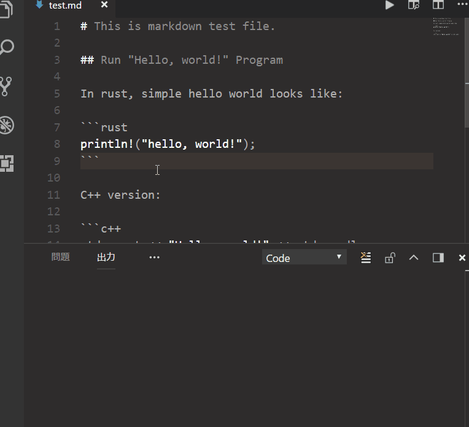

# vscode-markdown-run-snippet

Run snippets in your markdown document.



## Features

* Running code snippet in Markdown file

## Usages

Markdown has syntax for code snippets:

    ```language
    your_code.goes_here();
    ```

1. Select the whole snippet (including the marker: \`\`\`).
1. Run `Run Snippet in Markdown` from command palette.

This extension automatically open new untitled document. Its content is the
snippet, filetype is the one specified at just after
beginning marker (`language` part of beginning marker ` ```language `). Inserted snippet is modified based on language-specific template from the
original (surrounded by \`\`\`) snippet.

## Requirements

This extension depends on the following extension:

* [Code Runner](https://github.com/formulahendry/vscode-code-runner)

    Great extension to run opening code snippet. Running the extracted snippet is
    all done by this extension. Can be installed from MarketPlace.

## Extension Settings

* `markdown-run-snippet.mdToVscodeTypeMap`

    Map from language specified in Markdown to Visual Studio Code's filetype.
    If there is no entry, the same string is used as Visual Studio Code's filetype.

    Example:

    ```json
     "markdown-run-snippet.mdToVscodeTypeMap": {
        "c++": "cpp"
    }
    ```

    With the above setting, we can collectly set the filetype to `cpp` for
    snippet below:

        ```c++
        std::cout << "hello!" << std::endl;
        ```
    
    Without the above setting, this extension assume the filetype `c++`. However
    Visual Studio Code can't recognize it, so it fails to run this snippet.
    

* `markdown-run-snippet.mdTypeToTemplateMap`

    Map from language specified in Markdown to template (that will be applied to
    the snippet). Template feature is useful for importing common modules,
    including common headers, defining main() function. selected snippet will be
    placed at the position of `$snippet`. The leading ' '(whitespace) before
    `$snippet` is important, because the same amount of ' ' will be prepended to
    all lines of selected snippet.

    Example:

    ```json
    "markdown-run-snippet.mdTypeToTemplateMap": {
        "rust": "fn main() {\n    $snippet\n}"
    }
    ```

    With above setting, we can run snippet below even if we have to define
    `main()` function in Rust language:

        ```rust
        let name = "foo";
        println!("Hello, {}", name);
        ```
    
    The above snippet will be expanded as follows:

    ```rust
    fn main() {
        let name = "foo";
        println!("Hello, {}", name);
    }
    ```

    Similary, C++ requires to define `main()` function. Also C++ needs a lot of
    header files to run. Let's make it template:

    ```json
    "markdown-run-snippet.mdTypeToTemplateMap": {
        "rust": "fn main() {\n    $snippet\n}",
        "c++": "#include <iostream>\n#include <string>\nint main(void) {\n    $snippet\n}"
    }
    ```

    Now we can run the snippet below:

        ```c++
        std::string name = "foo";
        std::cout << "Hello, " << name << std::endl;
        ```

Very very few (almost no) configurations are defined by default.

## Known Issues


## Change Log

See Change Log [here](CHANGELOG.md)